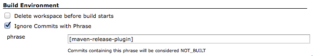
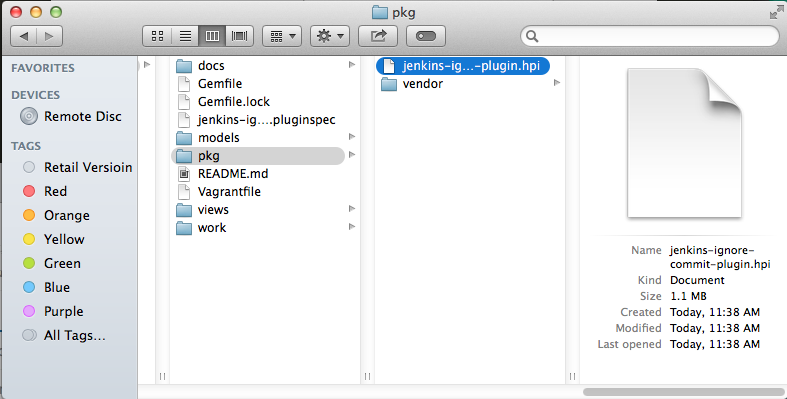
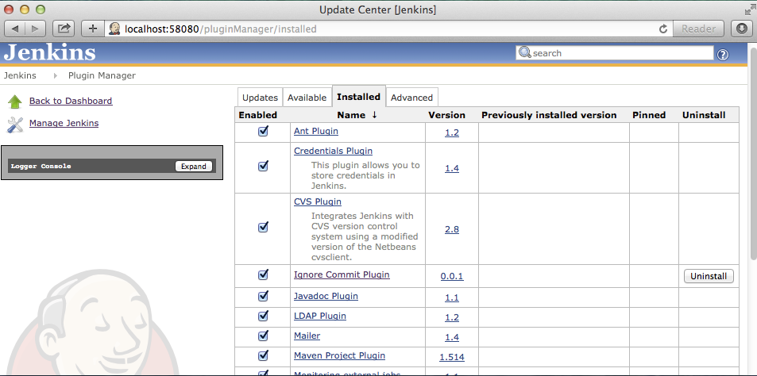
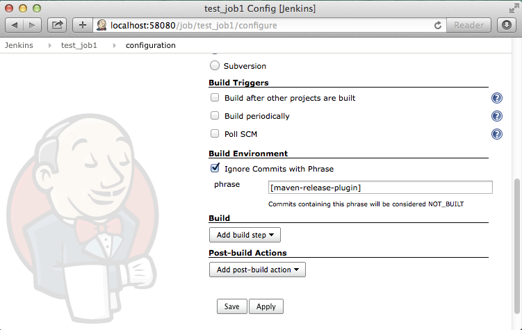

# Jenkins Ignore Commit Plugin
Jenkins jobs often poll for (or get triggered by) commits to scm repos and initiate build steps. We saw scenarios where we'd like to not initiate builds when the commit message contains a specified phrase. 

## Installation
Install the plugin from the Jenkins Plugin Manager.

### Enabling the Plugin
In the job configuration, enable the "Ignore Commits with Phrase" and provide the Phrase.



### How it works 
Jenkins is based on works by changeset, so if there is changeset from before build and commit includes the phrase, then build is skipped as NOT_BUILT. If there is no changeset, it will be build.

## Building the JRuby Jenkins Plugins from Source
Building and testing Jenkins plugins developed in JRuby requires Java, Maven, Jenkins, JRuby, and the JPI gem. The included Vagrantfile provisions a fully self contained build and run time environment for any JRuby based Jenkins plugin. To use it, you will need to have:
- Vagrant - http://www.vagrantup.com
- Virtualbox - https://www.virtualbox.org

Once you have both of these installed, you can run the following command:
```
vagrant up
```
This will take a few minutes to bootstrap a base Centos image with the required items. If you need to bring up this environment multiple times, you may want to look at the vagrant package command to build a new image and avoid running the bootstrap scripts every time.

After all the required software is installed, the Vagrantfile will execute the JPI_script block that will:

**1) Build the plugin**

The script calls jpi build, that will create a pkg folder containing the jenkins-ignore-commit-plugin.hpi file. This file can be uploaded into your Jenkins system.



**2) Run the plugin within Jenkins**

The script calls jpi server, which starts an instance of Jenkins in the Virtualbox image with the new plugin installed. Since port forwarding is defined in the Vagrantfile, you can access the Jenkins instance from a browser on your host machine at:
```
http://localhost:58080
```




## Changelog
### Version 0.0.1 (Jan 13, 2015)
* initial release

